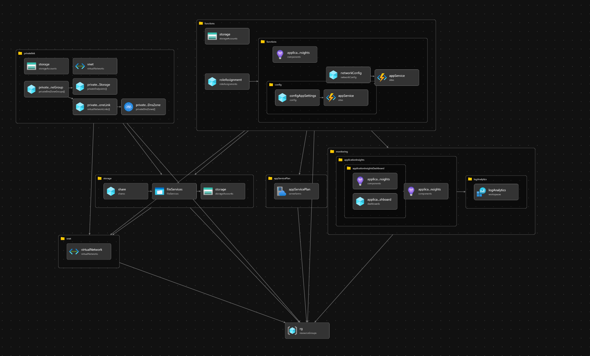

# Azure Functions - Managed Identity

This is a sample repo to demonstrate how to use Azure Functions System Assigned Managed Identity to connect to Power Apps WebAPI - without any password, secret or certificate.

Blog Post: https://dreamingincrm.com/2021/11/16/connecting-to-dataverse-from-function-app-using-managed-identity/

The above blog post is now obsolete. You can deploy this template using Azure Developer CLI. The command to run is

`azd up`

This README will be updated by end of this week (1/08/2023) to reflect the correct process. In the meantime please refer the bicep code.

# Architecture

